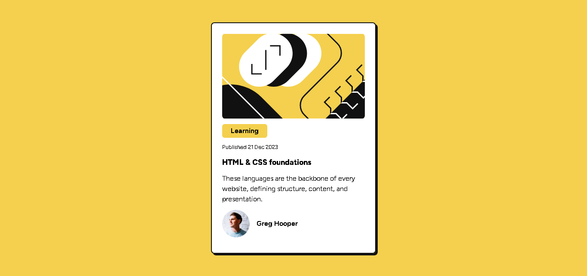

# Frontend Mentor - Blog preview card solution

This is a solution to the [Blog preview card challenge on Frontend Mentor](https://www.frontendmentor.io/challenges/blog-preview-card-ckPaj01IcS). Frontend Mentor challenges help you improve your coding skills by building realistic projects. 

## Table of contents

- [Overview](#overview)
  - [The challenge](#the-challenge)
  - [Screenshot](#screenshot)
  - [Links](#links)
- [My process](#my-process)
  - [Built with](#built-with)
  - [What I learned](#what-i-learned)
  - [Continued development](#continued-development)
  - [Useful resources](#useful-resources)
- [Author](#author)
- [Acknowledgments](#acknowledgments)

**Note: Delete this note and update the table of contents based on what sections you keep.**

## Overview
This is a simple card project built for the purpose of learning tailwind css. Was built to learn the installation and set up of tailwind and to experiment some of its utility classes

### The challenge

Users should be able to:

- See hover and focus states for all interactive elements on the page

### Screenshot

### Links

- Live Site URL: [Add live site URL here](https://preview-sage.netlify.app/)

## My process

### Built with

- Semantic HTML5 markup
- Flexbox
- Mobile-first workflow
- Tailwind CSS

### What I learned

This card project thought me how to install tailwind using the CLI, font-family customization and usage of tailwind utility classes. I look forward to improve my knowledge of tailwind css and becoming a better developer.

### Continued development

I will continue to go deeper into responsive design and uping my css design skills. To become one of the best developers in the world.

### Useful resources

- [Tailwind docs](https://www.tailwindcss.com) - Help me to understand the basis of the framework
- [Guillaume Duhan](https://www.youtube.com/watch?v=ft30zcMlFao) - This youtube tutorial by Duhan in collaboration with freecodecamp really helped me alot in understanding the framework

**Note: Delete this note and replace the list above with resources that helped you during the challenge. These could come in handy for anyone viewing your solution or for yourself when you look back on this project in the future.**

## Author

- Frontend Mentor - [@Jerryhugo](https://www.frontendmentor.io/profile/jerryhugo)
- Twitter - [@sage.dev](https://www.twitter.com/insp_family)

## Acknowledgments

Thanks to frontend mentor for creating these challenges and freecodeCamp (Duhan) for the tutorial. And amazing thank you to every contributor to the taillwind css framework and for good code documentation.

